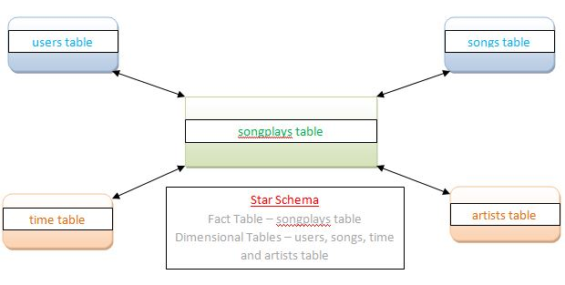

### Introduction
***
A music streaming startup, Sparkify, has grown their user base and song database even more and want to move their data warehouse to a data lake. Their data resides in S3, in a directory of JSON logs on user activity on the app, as well as a directory with JSON metadata on the songs in their app. 
We are required to –
* Build ETL pipeline that extracts data from S3
* Processes them using Spark
* Transforms data into a set of dimensional tables for analytics
* Loads the data back into S3 as a set of dimensional tables

### Project Description
*** 
We need to use Spark and data lakes to build an ETL pipeline for a data lake hosted on S3. We will load data from S3, process the data into analytics tables using Spark, and load them back into S3

**Song Dataset** – This dataset is a subset of real data from the Million Song Dataset. Each file is in JSON format and contains metadata about a song and the artist of that song. The files are partitioned by the first three letters of each song's track ID. For this project alone we will only use the file loaded in Udacity S3 Bucket location of song-data/A/A/A/*.json as it takes huge amount of time to process complete datasets. 

**Log Dataset** – This dataset consists of log files in JSON format generated by this event simulator based on the songs in the dataset above. These simulate activity logs from a music streaming app based on specified configurations. 

All the 4 domensional tables (users, songs, artists and time) extracted through above stated datasets will be connected to one Fact Table called as songplays as mentioned below in the Star Schema.

#### Users table Columns –
user_id, first_name, last_name, gender, level

#### songs table columns –
song_id, title, artist_id, year, duration

#### artists table columns –
artist_id, name, location, latitude, longitude

#### time table columns –
start_time, hour, day, week, month, year, weekday

### Project Steps –
* Add configuration details in dl.cfg
* Call the Function Create Spark Session to create one with my AWS credentials.
* Call the Function Process Songs Dataset, we retrive the dataset in Temporary View and through that we extract 2 tables called as **songs** and **artists** and load them into my S3 bucket
* Call the Function Process Logs Dataset, we retrive the dataset in Temporary View and through that we extract 2 tables called as **Users** and **time** and load them into my S3 bucket
* For extracting Fact Table called as **songplays** we will create the temporary view from songs table already in my S3 bucket, joined to Log Dataframe and finally load it into my S3 Bucket as well.
* Through **JUPYTER TERMINAL** give the command **python etl.py**. All the functions will start processing
* Output of the terminal is attached below in last section
* Remove my credentials from the dl.cfg
* Delete my S3 bucket after use as unnecessarily it might incure cost

### Conclusion
All steps were executed and project rubric mentioned were achieved to produce the required analysis for this project.

### Output
***

Finally we can check that AWS S3 Bucket is loaded with 4 dimensional Table and one Fact Table.
